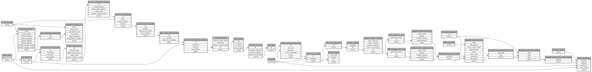

```
# AUTOGENERATED BY ECOSCOPE-WORKFLOWS; see fingerprint in README.md for details

```

```yaml
# fingerprint:
artifacts_sha256_basic: e207c5315a1d8fca0cc69084831b1cf3e2908e572cc57462f6beef97e65fa3d9
artifacts_sha256_strict: 505e8dc5c4244edf29b23374f08ebf099e380506380a13f3fb373a0761d116a7
installed_requirements:
- channel: https://repo.prefix.dev/ecoscope-workflows/
  name: ecoscope-platform
  version: {version: ==2.11.15}
- channel: https://repo.prefix.dev/ecoscope-workflows-custom/
  name: ecoscope-workflows-ext-custom
  version: {version: ==0.1.0rc6}
params_sha256: 3229dd47f31447884b2e79e8d056c4a9e0870d415a07a8669c3e999d85bd76e4
spec_sha256: 01518185b42023de152cb82f85987180702001ac241fcae02b1de623d53ec4a0

```

# ecoscope-workflows-gcf-event-download-workflow


